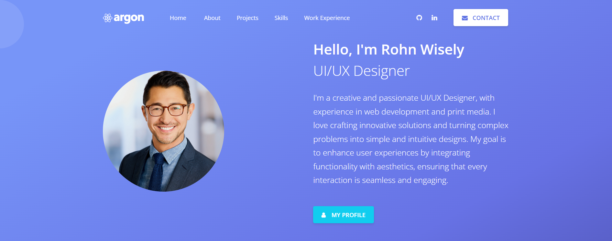
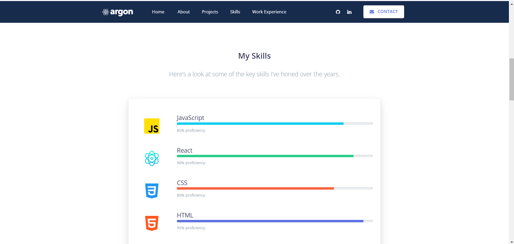
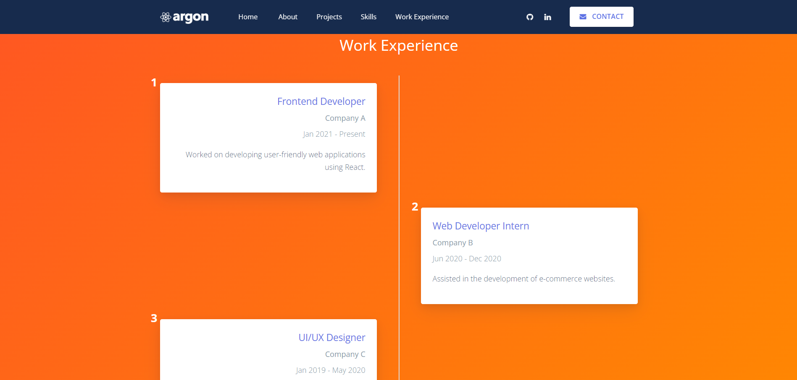
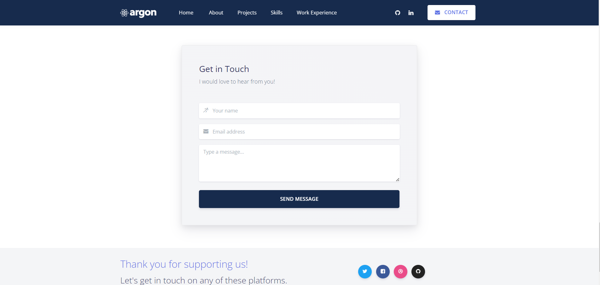

# Portfolio Page (Person Profile)

This repository contains a fully designed and functional UI for a personal profile page. The project showcases a professional portfolio that allows users to effectively present their personal or professional information.

## Table of Contents
- [Project Overview](#project-overview)
- [Features](#features)
- [Technologies Used](#technologies-used)
- [Screenshots](#screenshots)
- [Getting Started](#getting-started)
- [Contact](#contact)
- [Acknowledgments](#acknowledgments)

## Project Overview
The Portfolio Page enables users to showcase their personal and professional profiles through a structured layout. It includes a Home Page with a brief introduction, a Profile Details Page that provides an in-depth view of the user’s biography, skills, achievements, and projects, as well as a Contact Page that facilitates communication.

## Features
- **Home Page**: A brief introduction or summary of the person.
- **Profile Details Page**: Detailed biography, skills, achievements, and notable projects.
- **Contact Page**: A form for visitors to reach out.

## Technologies Used
- React.js
- Reactstrap (Bootstrap components for React)
- JavaScript
- CSS
- HTML

## Screenshots
Here are some screenshots of the main pages of the portfolio:

### Home Page


### Skills Page


### Experience Page


### Contact Page


## Getting Started
To get a local copy up and running, follow these simple steps:

1. Clone the repository:
   ```bash
   git clone https://github.com/yourusername/portfolio-page.git


## Getting Started
To get a local copy up and running, follow these simple steps:

1. Clone the repository:
   ```bash
   git clone https://github.com/yourusername/portfolio-page.git](https://github.com/BhojrajCSE21/argon-design-system-react-master.git
   ```
2. Navigate to the project directory:
   ```bash
   cd argon-design-system-react-master
   ```
3. Install the dependencies:
   ```bash
   npm install
   ```
4. Start the development server:
   ```bash
   npm start
   ```

## Contact
For any inquiries, please reach out to me at: bhojrajnarware@gmail.com
